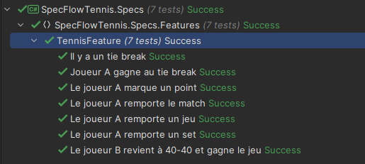

# PROJET BDD TENNIS

## Description

Ce projet est une API permettant de gérer un match de tennis, en suivant les règles standard de comptage des points et de gestion des sets et tie-breaks. Il a été développé en suivant les principes du développement piloté par les tests (BDD) avec SpecFlow pour .NET.

## Fonctionnalités


- Gérer les points des joueurs en fonction des règles du tennis.
- Afficher le score du jeu en cours.
- Gérer les avantages des joueurs.
- Gérer les tie-breaks.
- Déterminer le vainqueur du jeu, du set et du match.
- Réinitialiser les scores après chaque jeu.

## Critères d'acceptance

- Le match commence avec deux joueurs.
- Un joueur peut marquer des points en fonction des règles du tennis (15, 30, 40, avantage).
- En cas de tie-break, les points sont comptés jusqu'à ce qu'un joueur ait au moins 7 points avec 2 points d'avance.
- Le vainqueur d'un jeu est déterminé lorsqu'un joueur a un avantage ou gagne après un tie-break.
- Un set est remporté par un joueur qui gagne au moins 6 jeux avec 2 jeux d'avance, sauf en cas de tie-break.
- Le vainqueur du match est le premier joueur à gagner deux sets.

## Installation

1. Cloner le dépôt.

```bash
git clone https://github.com/Bertrand2808/BDD_Tennis.git
```

2. Ouvrir le projet dans Visual Studio ou JetBrains Rider.

3. Restaurer les packages NuGet.

```bash
dotnet restore
```

4. Exécuter les tests.

```bash
dotnet test
```
ou `Test` -> `Run All Tests From Solution` dans votre IDE.

## Scénario

### Scénario 1 : Un joueur marque un point
```gherkin
Scenario: Le joueur A marque un point
    Given Le match commence entre A et B
    Then Le match devrait être EnCours
    Given Le set est EnCours
    And Le jeu est EnCours
    When Joueur A marque un point
    Then le score devrait être :
      | Joueur | Score | Set 1 | Set 2 | Set 3 |
      | A      |  15   |   0   |   0   |   0   |
      | B      |   0   |   0   |   0   |   0   |
    And Le jeu devrait être EnCours
```

### Scénario 2 : Le joueur A remporte un jeu
```gherkin
Scenario: Le joueur A remporte un jeu
    Given Le match commence entre A et B
    Then Le match devrait être EnCours
    Given Le set est EnCours
    And Le jeu est EnCours
    And Le score est de :
      | Joueur | Score | Set 1 | Set 2 | Set 3 |
      | A      |  40   |   0   |   0   |   0   |
      | B      |   0   |   0   |   0   |   0   |
    When Joueur A marque un point
    Then Le jeu devrait être Terminé
    And le score devrait être :
      | Joueur | Score | Set 1 | Set 2 | Set 3 |
      | A      |   0   |   1   |   0   |   0   |
      | B      |   0   |   0   |   0   |   0   |
    And Le set devrait être EnCours
    And le resultat du jeu devrait être "Le Joueur A mène 1 jeu à 0"
```

### Scénario 3 : Le joueur A remporte un set
```gherkin
Scenario: Le joueur A remporte un set
    Given Le match commence entre A et B
    Then Le match devrait être EnCours
    Given Le set est EnCours
    And Le set en cours est le set 1
    Then Le set en cours devrait être le set 1
    Given Le jeu est EnCours
    And Le score est de :
      | Joueur | Score | Set 1 | Set 2 | Set 3 |
      | A      |  40   |   5   |   0   |   0   |
      | B      |   0   |   0   |   0   |   0   |
    When Joueur A marque un point
    Then Le jeu devrait être Terminé
    And le score devrait être :
      | Joueur | Score | Set 1 | Set 2 | Set 3 |
      | A      |   0   |   6   |   0   |   0   |
      | B      |   0   |   0   |   0   |   0   |
    And Le set devrait être Terminé
    And Le set en cours devrait être le set 2
    And le resultat du set devrait être "Le Joueur A remporte le set 6 jeux à 0"
```

### Scénario 4 : Le joueur A remporte le match
```gherkin
Scenario: Le joueur A remporte le match
  Given Le match commence entre A et B
  Then Le match devrait être EnCours
  Given Le set est EnCours
  And Le set en cours est le set 2
  And Le jeu est EnCours
  And Le score est de :
    | Joueur | Score | Set 1 | Set 2 | Set 3 |
    | A      |  40   |   6   |   5   |   0   |
    | B      |   0   |   0   |   0   |   0   |
  When Joueur A marque un point
  Then Le jeu devrait être Terminé
  And le score devrait être :
    | Joueur | Score | Set 1 | Set 2 | Set 3 |
    | A      |   0   |   6   |   6   |   0   |
    | B      |   0   |   0   |   0   |   0   |
  And Le set devrait être Terminé
  And le resultat du match devrait être "Jeu, set et match. Victoire du Joueur A : 6-0, 6-0"
```

### Scénario 5 : Le joueur B revient à 40-40 et gagne le jeu
```gherkin
Scenario: Le joueur B revient à 40-40 et gagne le jeu
  Given Le match commence entre A et B
  Then Le match devrait être EnCours
  Given Le set est EnCours
  And Le jeu est EnCours
  And Le score est de :
    | Joueur | Score | Set 1 | Set 2 | Set 3 |
    | A      |  40   |   5   |   0   |   0   |
    | B      |  30   |   0   |   0   |   0   |
  When Joueur B marque un point
  Then le score devrait être :
    | Joueur | Score | Set 1 | Set 2 | Set 3 |
    | A      |  40   |   5   |   0   |   0   |
    | B      |  40   |   0   |   0   |   0   |
  And Le jeu devrait être EnCours
  When Joueur B marque un point
  Then le score devrait être :
    | Joueur | Score | Set 1 | Set 2 | Set 3 |
    | A      |  40   |   5   |   0   |   0   |
    | B      |  AV   |   0   |   0   |   0   |
  And Le jeu devrait être EnCours
  When Joueur B marque un point
  Then Le jeu devrait être Terminé
  And le score devrait être :
    | Joueur | Score | Set 1 | Set 2 | Set 3 |
    | A      |   0   |   5   |   0   |   0   |
    | B      |   0   |   1   |   0   |   0   |
  And le resultat du jeu devrait être "Le Joueur A mène 5 jeux à 1"
```

### Scénario 6 : Il y a un tie break
```gherkin
Scenario: Il y a un tie break
  Given Le match commence entre A et B
  Then Le match devrait être EnCours
  Given Le set est EnCours
  And Le set en cours est le set 2
  And Le jeu est EnCours
  And Le score est de :
    | Joueur | Score | Set 1 | Set 2 | Set 3 |
    | A      |  15   |   6   |   6   |   0   |
    | B      |  40   |   4   |   5   |   0   |
  When Joueur B marque un point
  Then le score devrait être :
    | Joueur | Score | Set 1 | Set 2 | Set 3 |
    | A      |   0   |   6   |   6   |   0   |
    | B      |   0   |   4   |   6   |   0   |
  And Le jeu devrait être Terminé
  And le resultat du jeu devrait être "6-6 dans le set en cours, tie break"
```

### Scénario 7 : Joueur A gagne au tie break
```gherkin
Scenario: Joueur A gagne au tie break
  Given Le match commence entre A et B
  Then Le match devrait être EnCours
  Given Le set en cours est le set 2
  And Le jeu est EnCours
  And Le set est TieBreak
  And Le score est de :
    | Joueur | Score | Set 1 | Set 2 | Set 3 |
    | A      |   6   |   2   |   6   |   0   |
    | B      |   1   |   6   |   6   |   0   |
  When Joueur A marque un point
  Then le score devrait être :
    | Joueur | Score | Set 1 | Set 2 | Set 3 |
    | A      |   0   |   2   |   7   |   0   |
    | B      |   0   |   6   |   6   |   0   |
  And Le jeu devrait être Terminé
  And Le set devrait être Terminé
  And Le set en cours devrait être le set 3
  And le resultat du set devrait être "Le Joueur A remporte le set 7 jeux à 6"
```

## Tests


